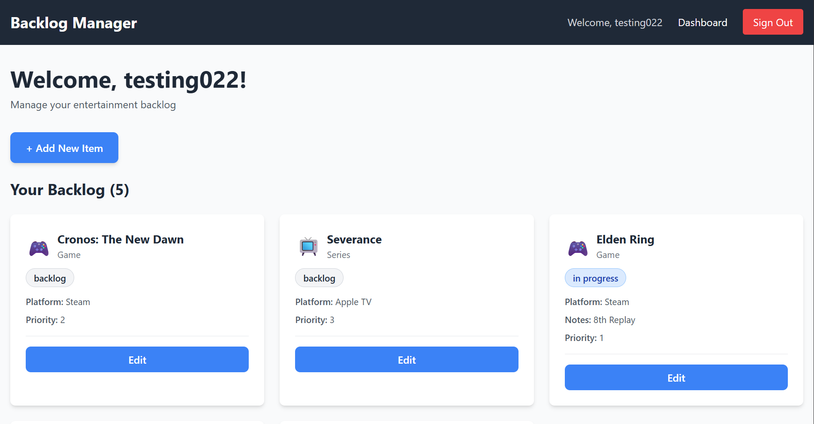

Backlog Manager allows you to add media, such as movies and series, as well as video games to your backlog. It can be used as a tool to help you prioritize what you would like to finish or watch next, while also updating the progress on the current thing. It can be set to "in progress" or "completed", and you can also update it to "dropped" in case you didn't like it while watching or playing it. 

User Stories: 
⦁	As a user, I want to be able to sign up, log in, and log out.

⦁	As a user, I want to be able to create a backlog and add items to it

⦁	As a user, I want to be able to track the items in my backlog, and add a priority to them

⦁	As a user, I want to be able to add my progress to the item (in progress, completed, dropped)

⦁	As a user, I want to be able to edit and delete the items in my backlog

Attributions: 
⦁	React Router - Client-side routing

⦁	Tailwind CSS - Utility-first CSS framework

Technologies Used:

Frontend:

JavaScript
React
React Router
Tailwind CSS
Vite
Axios

Backend:

Node.js
Express
MongoDB
Mongoose
JSON Web Tokens (JWT)
bcrypt

Development Tools:

Postman (API testing)
Git & GitHub